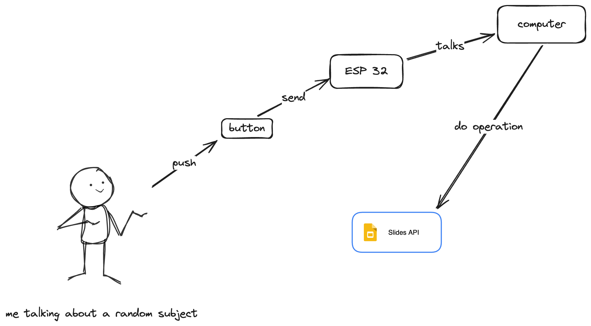

# Tiny-remote 🎮

This project is a subject of a conference talk at LFT for BedrockStreaming. For now, this project is a work in progress. 

## What's the point ? 
The aim of this project is to build a remote based on TinyGo language. This remote will help me to manage my slides during my talk. 

## Why ? ❓
I'm super shy about talking of a technical subject in front of people. I'm trying to improve myself by doing this talk.
Encourage by my manager, I'm trying to do my best to make this talk as good as possible. As a speaker, I forget to take a remote for managing my slides during my rtalks. 
That's why I get the idea to make my own with TinyGo.
As a PHP and Go developer, I've made a little of IoT with C++ that's why I want to try TinyGoi to compare experience and to see if as a Go developer the work will be hard or okay. 

## How it's work ? 🏗️
*(little WIP 🏗️)*

## My expectations 💭
- [ ] Be able to manage my slides with a remote
- [ ] Be able to implement code easily
- [ ] Have a lot of things to say about TinyGo

## Planning 📅